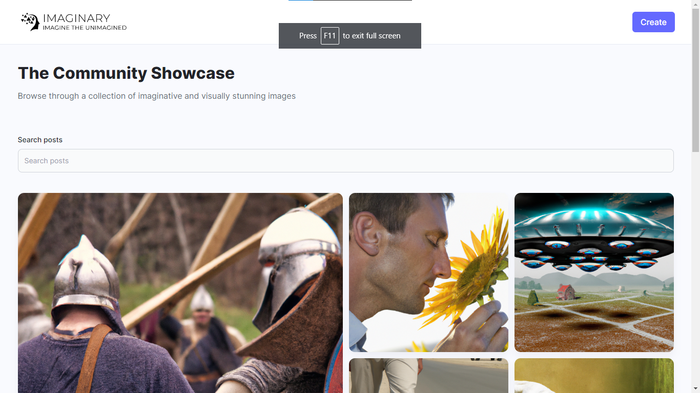
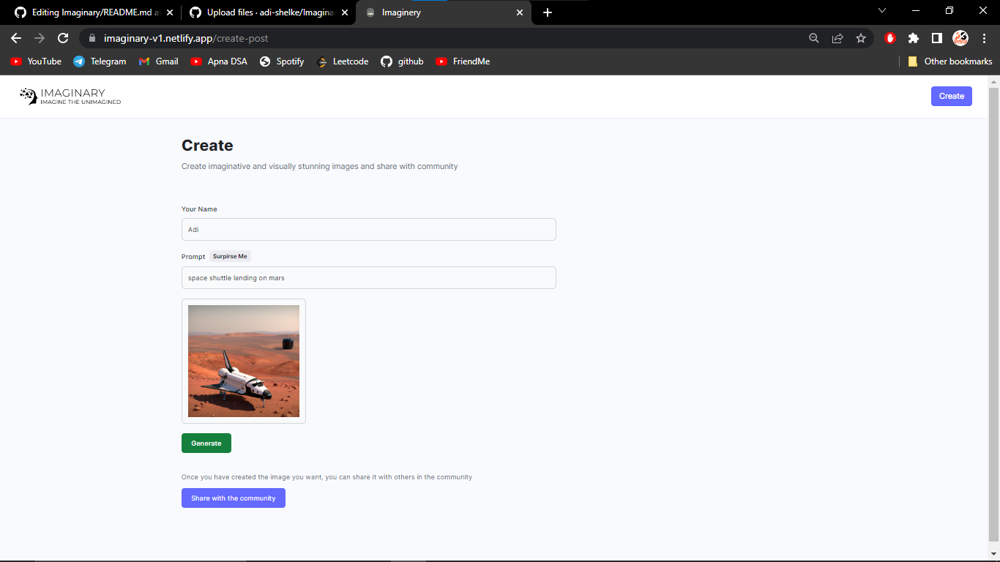

# Imaginary - AI based image generation tool

Imaginary is a AI based tool that can be used to generate, view and share images in the community.


## Authors

- [@Adinath Shelke](https://github.com/adi-shelke)


## Home page



## Create Image Page



## Run Locally

Clone the project

```bash
  git clone https://github.com/adi-shelke/Imaginary.git
```

Go to the project directory

```bash
  cd my-project
```

Install dependencies

```bash
  npm install
```

Start the server

```bash
  npm run start
```


## Features

- Used 'Cloudinary to store the images'
- Used MongoDb to store the user and image url
- Single page application
- Images can be generated, shared and downloaded


# Hi, I'm Adi! 👋

I am an IT student having a good knowledge of Web Technologies with experience of more than 2 years. I work on various web based projects, mainly on MERN stack.
## 🔗 Links

[](https://www.linkedin.com/in/adinath-shelke-2519b4203)
[](https://instagram.com/adi_shelke_07)

